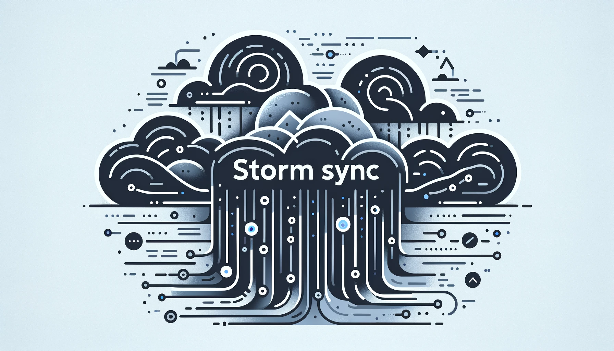

<p style="text-align:center">
	
    
</p>

<p style="text-align:center">
  
</p>

<hr>

## Overview

The Stormsync data collector is an open-source Go project designed for collecting hail, wind, and tornado Storm Reports
from the National Weather Center. The core functionality involves collecting data from designated URLs, de-duplicating
entries, and forwarding valid reports to a Kafka topic for downstream consumption.

| Report Type    | URL                                                                                                            |
|----------------|----------------------------------------------------------------------------------------------------------------|
| Wind Report    | [https://www.spc.noaa.gov/climo/reports/today_wind.csv](https://www.spc.noaa.gov/climo/reports/today_wind.csv) |
| Hail Report    | [https://www.spc.noaa.gov/climo/reports/today_hail.csv](https://www.spc.noaa.gov/climo/reports/today_hail.csv) |
| Tornado Report | [https://www.spc.noaa.gov/climo/reports/today_torn.csv](https://www.spc.noaa.gov/climo/reports/today_torn.csv) |

---

## Getting Started

**System Requirements:**

* **Go**: `version 1.22.x`

### Installation

<h4>From <code>source</code></h4>

> 1. Clone the repository:
>
> ```console
> $ git clone https://github.com/stormsync/collector
> ```
>
> 2. Change to the collector directory:
> ```console
> $ cd collector/cmd/collect
> ```
>
> 3. Build the app:
> ```console
> $ go build -o app
> ```

### Usage

<h4>From <code>source</code></h4>

> Run using the command below:
> ```console
> KAFKA_ADDRESS="my.kafka.ip-or-hostname:PORT"
> KAFKA_USER="my-kafka-username"
> KAFKA_PASSWORD="my-kafka-password"
> TOPIC="kafka-topic-to-send-reports-to"
> POLLING_INTERVAL_IN_SECONDS="60"
> REDIS_ADDRESS="my-redis-ip-or-hostname:PORT"
> REDIS_USER="my-redis-user"
> REDIS_PASSWORD="my-redis-password"
> ./app
> ```

If you do not use the environment variables or do not have them set in the environment you will see the following:
> ```console
> time=2024-05-21T11:02:59.097-05:00 level=ERROR msg="ENV variable required" Name=KAFKA_ADDRESS
> time=2024-05-21T11:02:59.097-05:00 level=ERROR msg="ENV variable required" Name=KAFKA_USER
> time=2024-05-21T11:02:59.097-05:00 level=ERROR msg="ENV variable required" Name=KAFKA_PASSWORD
> time=2024-05-21T11:02:59.097-05:00 level=ERROR msg="ENV variable required" Name=TOPIC
> time=2024-05-21T11:02:59.097-05:00 level=ERROR msg="ENV variable required" Name=POLLING_INTERVAL_IN_SECONDS
> time=2024-05-21T11:02:59.097-05:00 level=ERROR msg="ENV variable required" Name=REDIS_ADDRESS
> time=2024-05-21T11:02:59.097-05:00 level=ERROR msg="ENV variable required" Name=REDIS_USER
> time=2024-05-21T11:02:59.097-05:00 level=ERROR msg="ENV variable required" Name=REDIS_PASSWORD
> ```

### Tests

> Run the test suite using the command below from the root directory of the repo:
> ```console
> $ go test ./...
> ```

---

## Repository Structure

```sh
└── /
    ├── Dockerfile
    ├── cmd
    │   └── collect
    │       └── main.go
    ├── collector.go
    ├── collector_test.go
    ├── go.mod
    ├── go.sum
    ├── golangci.yaml
    ├── image
    │   └── stormsync-banner.png
    ├── redis.go
    ├── reporttype_string.go
    └── test_data
        ├── filtered_hail.csv
        ├── filtered_torn.csv
        ├── filtered_wind.csv
        └── nws_office_id_list.txt
```

[//]: # (## Project Roadmap)

[//]: # ()
[//]: # (- [X] `► INSERT-TASK-1`)

[//]: # (- [ ] `► INSERT-TASK-2`)

[//]: # (- [ ] `► ...`)

[//]: # ()
[//]: # (---)

## Contributing

Contributions are welcome! Here are several ways you can contribute:

- **[Report Issues](https://local//issues)**: Submit bugs found or log feature requests for the `` project.
- **[Submit Pull Requests](https://local//blob/main/CONTRIBUTING.md)**: Review open PRs, and submit your own PRs.
- **[Join the Discussions](https://local//discussions)**: Share your insights, provide feedback, or ask questions.

<summary>Contributing Guidelines</summary>

1. **Fork the Repository**: Start by forking the project repository to your local account.
2. **Clone Locally**: Clone the forked repository to your local machine using a git client.
   ```sh
   git clone ../
   ```
3. **Create a New Branch**: Always work on a new branch, giving it a descriptive name.
   ```sh
   git checkout -b new-feature-x
   ```
4. **Make Your Changes**: Develop and test your changes locally.
5. **Commit Your Changes**: Commit with a clear message describing your updates.
   ```sh
   git commit -m 'Implemented new feature x.'
   ```
6. **Push to local**: Push the changes to your forked repository.
   ```sh
   git push origin new-feature-x
   ```
7. **Submit a Pull Request**: Create a PR against the original project repository. Clearly describe the changes and
   their motivations.
8. **Review**: Once your PR is reviewed and approved, it will be merged into the main branch. Congratulations on your
   contribution!


<summary>Contributor Graph</summary>
<br>
<p style="text-align:center">
   <a href="https://local{//}graphs/contributors">
      
   </a>
</p>

---

## License

This project is protected under the [GNU Affero General Public License v3.0](https://choosealicense.com/licenses/agpl-3.0/)

---
